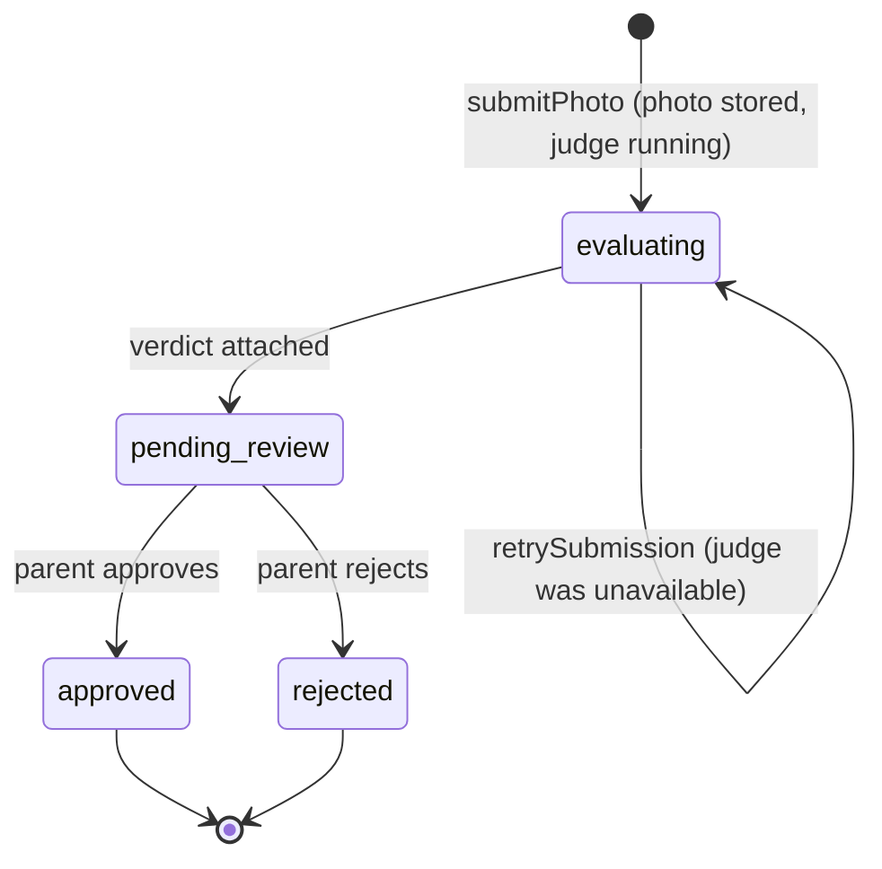
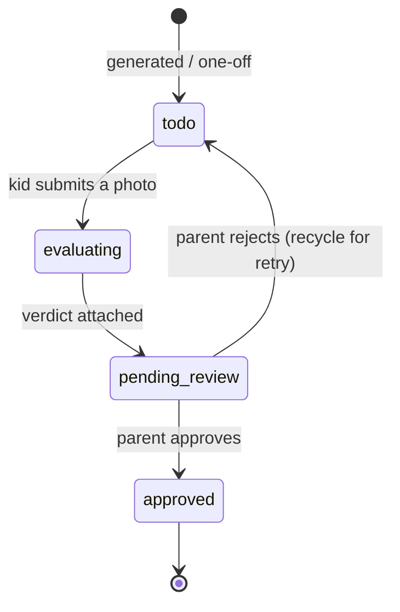

# Data model & state machine

The tables, the chore/submission lifecycle, the tenancy model, and the points ledger. Column facts
trace to [`supabase/migrations/`](../../supabase/migrations/); domain shapes to
[`src/domain/`](../../src/domain/). Enums are quoted from
[`src/domain/shared/enums.ts`](../../src/domain/shared/enums.ts).

> **Note on ids:** every primary key is an opaque `text` id (a branded string in the domain — see
> [Glossary § branded id](glossary.md#architecture)). Families/members/etc. default to
> `gen_random_uuid()::text`; a **submission id is minted by the caller** so the photo path can be
> staged before the row exists (§7.2).

---

## 1. Tables

### families
`0001_accounts.sql`

| Column | Type | Notes |
|---|---|---|
| `id` | text PK | |
| `name` | text NOT NULL | `length(btrim(name))` between 1 and 100 |
| `created_by` | text NOT NULL | founding parent's member id (app-enforced, no FK — avoids a circular ref with `members`) |
| `created_at` | timestamptz | default `now()` |

### members
`0001_accounts.sql` — a member is a **parent** or a **kid**.

| Column | Type | Notes |
|---|---|---|
| `id` | text PK | branded `MemberId` |
| `family_id` | text NOT NULL → `families(id)` ON DELETE CASCADE | tenant key |
| `kind` | text NOT NULL | CHECK `kind in ('parent','kid')` |
| `display_name` | text NOT NULL | 1–100 chars |
| `auth_user_id` | text UNIQUE, nullable | Supabase Auth uid (text) — **parents only** |
| `pin_hash` | text, nullable | scrypt `salt:hash` — **kids only** |
| `created_at` | timestamptz | default `now()` |

**Shape constraint:** `(kind='parent' AND pin_hash IS NULL) OR (kind='kid' AND auth_user_id IS
NULL)` — parents authenticate via Supabase Auth and have no PIN; kids have a PIN and no auth user
(design §3.1). Indexed on `(family_id)` and on `(auth_user_id) WHERE auth_user_id IS NOT NULL`.

### chore_templates
`0003_chores_submissions_points.sql` — a reusable, recurring chore definition.

| Column | Type | Notes |
|---|---|---|
| `id` | text PK | branded `TemplateId` |
| `family_id` | text NOT NULL → `families(id)` | tenant key |
| `title` | text NOT NULL | 1–80 chars |
| `description` | text, nullable | long-form; **snapshotted onto instances** and fed to the judge |
| `points` | integer NOT NULL | CHECK `points > 0` |
| `recurrence` | jsonb NOT NULL | serialized `Recurrence` (see §4) |
| `assigned_member_id` | text NOT NULL → `members(id)` | who it's for |
| `active` | boolean NOT NULL default true | controls lazy generation |
| `created_at` | timestamptz | default `now()` |

### chore_instances
`0003_*` — a single dated occurrence; the thing a kid completes.

| Column | Type | Notes |
|---|---|---|
| `id` | text PK | branded `InstanceId` |
| `family_id` | text NOT NULL → `families(id)` | tenant key |
| `template_id` | text, nullable → `chore_templates(id)` | **NULL for one-offs**; set for generated |
| `title`, `description`, `points` | — | **snapshots** taken at materialization (so editing a template doesn't rewrite history) |
| `assigned_member_id` | text NOT NULL → `members(id)` | who it's for |
| `due_date` | date NOT NULL | drives lazy generation |
| `status` | text NOT NULL default `'todo'` | CHECK in `('todo','evaluating','pending_review','approved')` — **no `rejected`** |
| `created_at` | timestamptz | default `now()` |

**Idempotency key** `chore_instances_generated_key`: `UNIQUE (template_id, assigned_member_id,
due_date) WHERE template_id IS NOT NULL`. This is what makes lazy generation safe to repeat.
One-offs (`template_id IS NULL`) sit outside it and are never regenerated.

### submissions
`0003_*` (+ `ai_verdict`/`decided_*` columns) — a kid's photo attempt at an instance.

| Column | Type | Notes |
|---|---|---|
| `id` | text PK | **caller-minted** (§7.2) |
| `family_id` | text NOT NULL → `families(id)` | tenant key |
| `instance_id` | text NOT NULL → `chore_instances(id)` | the chore |
| `submitted_by` | text NOT NULL → `members(id)` | the kid (or parent) |
| `photo_path` | text NOT NULL | path in the `chore-photos` bucket |
| `status` | text NOT NULL default `'evaluating'` | CHECK in `('evaluating','pending_review','approved','rejected')` |
| `ai_verdict` | jsonb, nullable | the advisory `Verdict`, attached on advance to `pending_review` |
| `decided_by` | text, nullable → `members(id)` ON DELETE SET NULL | the deciding parent |
| `decided_at` | timestamptz, nullable | when |
| `created_at` | timestamptz | default `now()` |

Indexed on `(family_id)` and `(family_id, status)` (the review queue lists by status).

### points_ledger
`0003_*` — append-only credits.

| Column | Type | Notes |
|---|---|---|
| `id` | text PK | |
| `family_id` | text NOT NULL → `families(id)` | tenant key |
| `member_id` | text NOT NULL → `members(id)` | who earns |
| `submission_id` | text NOT NULL **UNIQUE** → `submissions(id)` | **idempotency key** — one credit per approved submission |
| `delta` | integer NOT NULL | points (positive in v1) |
| `reason` | text NOT NULL | CHECK `reason = 'chore_approved'` (extensible for future redemptions) |
| `created_at` | timestamptz | default `now()` |

There is **no UPDATE/DELETE** policy — the ledger is append-only. A member's total is
`sum(delta) WHERE family_id = ? AND member_id = ?`; there is no mutable balance.

### `chore-photos` (Storage bucket)
`0002_storage.sql` — **private** bucket, 10 MB limit, MIME allowlist
`image/jpeg,png,webp,heic`. Path layout: `family_id/instance_id/submission_id.<ext>`
([`src/adapters/storage/path.ts`](../../src/adapters/storage/path.ts)). Uploads go through the
service-role client; reads use short-lived **signed URLs**.

---

## 2. RLS model

Every data table and the storage bucket have **per-family** Row-Level Security
(`0004_rls_*`, `0006_chore_photos_rls.sql`).

- **v1 runtime:** the app uses a **server-only service-role** adapter that bypasses RLS *and* scopes
  **every** query by `family_id` in application code. A cross-family id resolves to
  `null`/`not_found`. The in-memory adapter mirrors this exactly (which the contract suites prove).
- **RLS is defense-in-depth** for any future anon/authenticated-key path. Policies gate
  `SELECT/INSERT/UPDATE` on each table (and `SELECT/INSERT` only on `points_ledger`) via the helper
  `private.is_family_member(family_id)` — `SECURITY DEFINER`, locked `search_path`, returns true iff
  the JWT's `auth.uid()` is a member of that family. Storage policies extract the leading
  `family_id` segment of the object path.
- **Atomic RPCs** (service-role only): `create_family(...)` (`0001`) bootstraps a family + founding
  parent in one call; `record_verdict_and_advance(...)` (`0007`) attaches the verdict and advances
  submission + instance to `pending_review` in one transaction, so an infra fault can't half-commit.

---

## 3. State machine

Two coupled lifecycles. The **instance** has no `rejected` state — rejection is terminal on the
**submission** and recycles the instance to `todo` for a fresh attempt (§7.1).

**Submission lifecycle:**



**Instance lifecycle:**



**How they move together:**

| Step | Submission | Instance | Where |
|---|---|---|---|
| Kid submits photo | → `evaluating` | → `evaluating` | `submitPhoto` ([`usecases/submission.ts`](../../src/usecases/submission.ts)) |
| Judge returns (or retry succeeds) | → `pending_review` | → `pending_review` | atomic `recordVerdictAndAdvance` (RPC `0007`) |
| Judge unavailable | stays `evaluating` (photo kept) | stays `evaluating` | only exit is `retrySubmission` |
| Parent **approves** | → `approved` | → `approved` | `decide` ([`usecases/review.ts`](../../src/usecases/review.ts)); credits the ledger once |
| Parent **rejects** | → `rejected` (terminal) | → `todo` (recycle) | `decide` |

Transition validity is checked in the use-cases (e.g. a `decide` is only valid from
`pending_review`; a `retry` only from `evaluating`), returning `invalid_transition` otherwise.

> **Known gap (tracked):** `decide` performs its three writes (record decision · advance instance ·
> append points) sequentially, not yet in one transaction on the real adapter (issue #136). The
> ledger's `submission_id` idempotency bounds double-credit but not partial-commit.

---

## 4. Recurrence model

`Recurrence` ([`enums.ts`](../../src/domain/shared/enums.ts)) is a small closed union:

```ts
type Recurrence =
  | { kind: "none" }                       // a one-off; never scheduled
  | { kind: "daily" }                      // due every day
  | { kind: "weekly"; days: number[] };    // due on listed weekdays (0=Sun … 6=Sat, UTC)
```

`isDue(template, date)` ([`domain/chore/recurrence.ts`](../../src/domain/chore/recurrence.ts)) is
pure: `none` → never, `daily` → always, `weekly` → `days.includes(weekday(date))`, with a
compile-time exhaustiveness check. `weekday()` uses `Date.UTC(...).getUTCDay()` so the day-of-week is
timezone-independent.

**Lazy generation:** `getTodayBoard(memberId, date?)` ([`usecases/chores.ts`](../../src/usecases/chores.ts))
is the **only** operation that materializes instances. For each *active* template assigned to the
member that `isDue` on the date, it upserts a generated instance keyed on
`(template_id, assigned_member_id, due_date)` — idempotent, so calling it repeatedly never
duplicates. There is no cron in v1.

---

## 5. Points ledger model

`LedgerEntry` ([`domain/points/types.ts`](../../src/domain/points/types.ts)):
`{ familyId, memberId, submissionId, delta, reason: 'chore_approved', createdAt }`.

Invariants:

1. **Append-only** — no UPDATE/DELETE; the only write is `append`.
2. **Idempotent on `submissionId`** — the UNIQUE constraint guarantees exactly one credit per
   approved submission; a replayed `append` is a no-op (the violation is ignored). Approving twice
   never double-credits.
3. **No mutable balance** — `pointsTotal` is `sum(delta)` scoped by `familyId` + `memberId`.
4. **`reason`** is `'chore_approved'` in v1; negative deltas + new reasons are the open seam for
   future redemptions (design §6).

---

## Related

- [Architecture](architecture.md) — how the seams wrap this data.
- [API reference](api-reference.md) — the routes that drive these transitions.
- [Glossary](glossary.md) — terminology.
